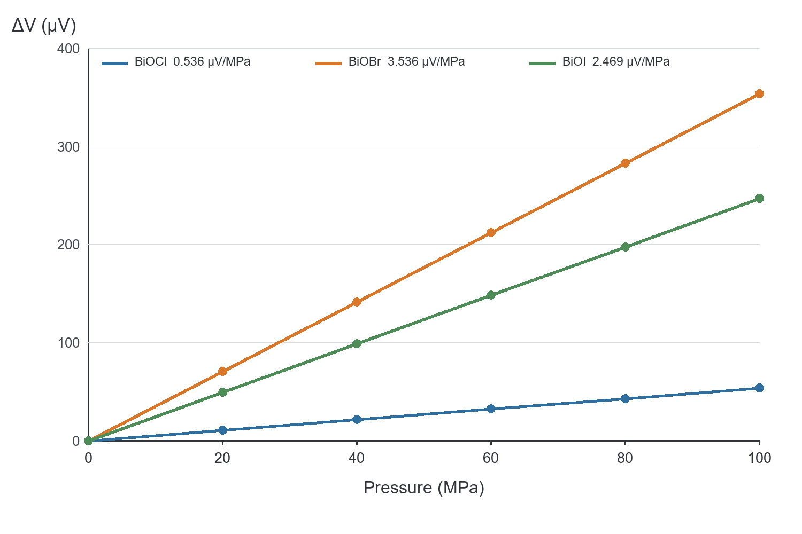
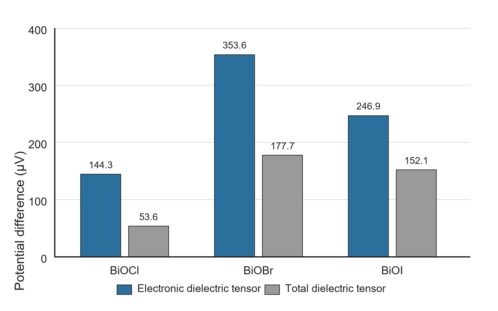
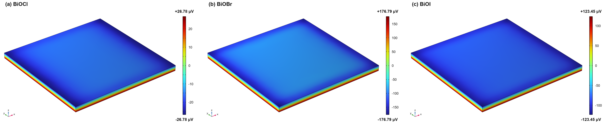

# Comparative piezoelectric finite-element analysis of BiOX (X = Cl, Br, I)

This repository contains a reproducible COMSOL Multiphysics 6.3 workflow for comparing the direct piezoelectric response of BiOCl, BiOBr, and BiOI under identical mechanical boundary conditions. The analysis was developed to support a broader study of halogen-dependent piezo-photocatalytic behavior in the BiOX series. Its purpose is to isolate the electromechanical contribution: it does not, by itself, model photocarrier generation, interfacial charge transfer, surface reactions, or pollutant degradation kinetics.



## Model scope

Each material is represented by a 100 x 100 x 5 nm rectangular domain using a stationary, linear piezoelectric formulation in stress-charge form. A uniform pressure is applied to the upper surface; the lower surface is mechanically fixed and electrically grounded. The remaining electrostatic boundaries are assigned zero surface charge. Material-specific elastic, dielectric, and piezoelectric tensors are supplied through a version-controlled JSON file, while geometry, mesh settings, and post-processing expressions are held constant across the series.

The reference calculation uses 100 MPa. A pressure sweep at 0, 20, 40, 60, 80, and 100 MPa is included to report response coefficients rather than relying on a single load case. The unloaded values are exact baselines; the nonzero points were obtained from stationary COMSOL solutions.

## Comparative results

The reference parameterization gives the following response at 100 MPa:

| Material | $\Delta V$ ($\mu$V) | Relative response | Maximum von Mises stress (MPa) | $d(\Delta V)/dp$ ($\mu$V MPa$^{-1}$) |
|---|---:|---:|---:|---:|
| BiOCl | 53.565 | 1.00 | 164.229 | 0.5357 |
| BiOBr | 353.590 | 6.60 | 174.032 | 3.5359 |
| BiOI | 246.905 | 4.61 | 140.472 | 2.4691 |

Under these assumptions, the calculated potential response follows BiOBr > BiOI > BiOCl. The result is consistent with a balanced contribution from elastic compliance, piezoelectric coupling, and dielectric screening in BiOBr. This interpretation is mechanistic rather than kinetic: a larger open-circuit potential is expected to favor charge separation, but it does not establish a degradation rate or a catalytic rate constant.

The linear pressure dependence ($R^2 = 1.000$ for all three materials) is expected from the linear constitutive law and load-independent boundary conditions. It is a verification of internal model behavior, not independent evidence of experimental linearity.

## Dielectric-convention sensitivity

The original reference parameter set combines the total static dielectric tensor for BiOCl with electronic dielectric tensors for BiOBr and BiOI. To test whether the ranking depends on this choice, all three materials were recalculated using either the electronic or total dielectric tensor consistently.



| Material | Electronic tensor, $\Delta V$ ($\mu$V) | Total tensor, $\Delta V$ ($\mu$V) |
|---|---:|---:|
| BiOCl | 144.295 | 53.565 |
| BiOBr | 353.602 | 177.652 |
| BiOI | 246.910 | 152.100 |

The absolute magnitude is sensitive to the dielectric convention, whereas the ordering BiOBr > BiOI > BiOCl remains unchanged. For low-frequency or quasi-static interpretation, the total dielectric tensor is generally the more relevant comparison, provided that all tensors refer to compatible structures, temperatures, and boundary conditions. The reference and sensitivity datasets are therefore retained separately.

## Field visualization

The centered potential maps use a common range of -177 to +177 $\mu$V so that color intensity has the same meaning for all three compounds. Independent-scale maps are also provided for inspecting spatial patterns, but they should not be used to compare response magnitude. Stress maps share a 0-175 MPa range.



## Experimental context

The accompanying PFM measurements used a 1 V drive and a 1 Hz scan rate. These settings define an electromechanical imaging experiment and cannot be converted directly into the 100 MPa normal pressure used in the finite-element benchmark. PFM and pressure-driven FEM are treated as complementary evidence chains: PFM provides local experimental contrast, whereas the FEM separates material-parameter effects under a controlled idealized load.

## Reproducibility

Requirements:

- Windows with COMSOL Multiphysics 6.3 and the Piezoelectricity functionality available
- Python 3.10 or later
- Packages listed in `requirements.txt`
- A valid COMSOL license
- A user-supplied base `.mph` file; proprietary model binaries are intentionally excluded

Example calculation:

```powershell
python src/biox_comsol_automation.py `
  --input-mph path\to\BiOCl_piezo.mph `
  --comsol-root path\to\COMSOL63\Multiphysics `
  --config config\biox_materials.json `
  --output-dir comsol_run `
  --epsilon-mode prompt `
  --cores 4
```

Use `--epsilon-mode vasp-electronic` or `--epsilon-mode vasp-total` for a consistent dielectric convention. The plotting scripts can be run independently after the tabulated data and raw COMSOL exports are available:

```powershell
python src/make_quantitative_figures.py
python src/create_independent_scale_figure.py
python src/make_dielectric_sensitivity_figure.py
```

`export_common_scale_figures.py` requires COMSOL-generated `.mph` files in the selected calculation output directory and reproduces the shared-scale field maps.

## Repository contents

```text
BiOX_Piezoelectric_COMSOL_v1.2.0/
|-- src/       COMSOL automation and figure-generation scripts
|-- config/    version-controlled material and model parameters
|-- data/      compact numerical results and raw image exports
|-- figures/   manuscript-ready comparative figures
|-- docs/      methods, data definitions, references, and limitations
|-- README.md
|-- RELEASE_NOTES.md
|-- CHANGELOG.md
|-- requirements.txt
`-- VERSION
```

Large `.mph` files, COMSOL installations, license files, virtual environments, and copyrighted article PDFs are excluded. This keeps the repository reviewable while preserving the inputs, scripts, numerical summaries, and visual outputs required to audit the reported comparison.

## Important limitations

The current model assumes a homogeneous, defect-free single domain, linear elasticity, linear piezoelectricity, and open-circuit electrostatics. It omits grain boundaries, porosity, particle contacts, defect dipoles, free-carrier screening, electrolyte screening, dynamic ultrasonic loading, and semiconductor reaction physics. In addition, the nonzero piezoelectric coefficients in the configuration were supplied independently; the archived first-principles outputs available during model construction reported zero piezoelectric tensors. These coefficients should therefore be replaced or validated against traceable experimental or first-principles values before absolute predictions are treated as material constants.

See [METHODS.md](docs/METHODS.md) and [INTERPRETATION_AND_LIMITATIONS.md](docs/INTERPRETATION_AND_LIMITATIONS.md) for the full reporting boundary.

## Citation and reuse

When using this workflow, cite the repository version, COMSOL Multiphysics version, and the primary source of every material tensor. No license is imposed in this update package; retain the license of the existing GitHub repository or add an appropriate license before redistribution.
