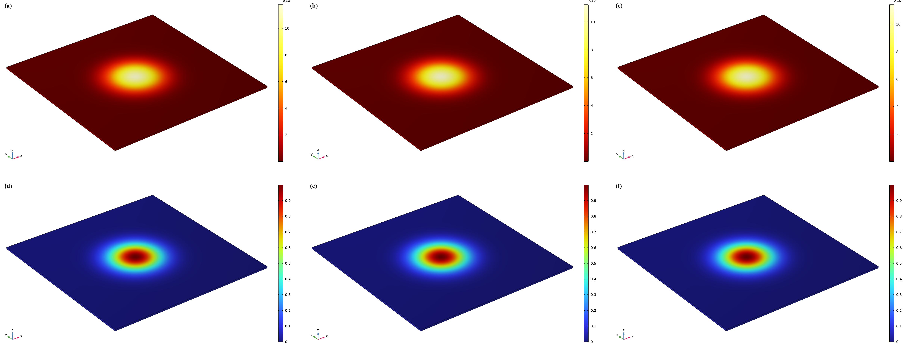
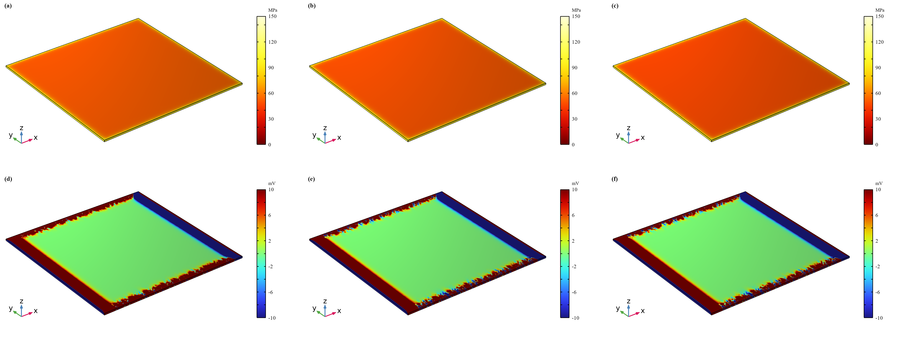

# DFT-informed apparent piezoelectric response of BiOX

This repository contains a reproducible COMSOL Multiphysics 6.3 workflow for
comparing the surface-normal electromechanical response of BiOCl, BiOBr, and
BiOI. The release is organized around the SSPFM observable rather than the
photocatalytic ranking of the materials.

## Scientific scope

The primary comparison is the apparent surface-normal PFM response measured on
pressed samples:

| Material | SSPFM `d33_app` (pm V^-1) | Relative response |
|---|---:|---:|
| BiOCl | 315.71 +/- 6.13 | 1.00 |
| BiOBr | 477.98 +/- 6.77 | 1.51 |
| BiOI | 649.67 +/- 9.33 | 2.06 |

The experimental order is therefore `BiOI > BiOBr > BiOCl`. The active finite-
element branch combines the supplied DFT elastic stiffness and dielectric
parameters with an explicitly labelled response-level closure based on the
measured SSPFM value. It is an apparent-response comparison, not a prediction
of an intrinsic bulk `d33`.

The supplied reference papers are used only to inform model design and figure
layout. They are not used as material constants or ranking constraints.

## Main result

Under the same 1 V Gaussian surface-potential proxy, the DFT-informed COMSOL
branch gives:

| Material | Simulated `d_eff` (pm V^-1) | Relative response |
|---|---:|---:|
| BiOCl | 19.84 | 1.00 |
| BiOBr | 30.03 | 1.51 |
| BiOI | 40.82 | 2.06 |

The calculated apparent order reproduces the SSPFM order. The nearly constant
ratio between simulated and measured response is a property of the present
contact and geometry proxy; it is not an additional material constant.



The direct-pressure benchmark is provided as a complementary field visualisation:



An independent direct-pressure benchmark from the legacy sensitivity branch is
also retained for context. At 100 MPa, the
peak-to-peak induced potentials are 14.89 mV (BiOCl), 16.18 mV (BiOBr), and
16.18 mV (BiOI). This result demonstrates the reciprocal direct electromechanical
response and shows that the pressure-induced potential is not identical to the
PFM apparent-response ranking.

## Constitutive model

The COMSOL material node uses the stress-charge form

\[
T=c^E S-e^T E,\qquad D=eS+\varepsilon_0\varepsilon_r^S E.
\]

The DFT branch imports `C^E` and the electronic-plus-ionic dielectric tensor
from `BiOX_FEA_DFT.zip`. The supplied VASP calculations report a zero total
macroscopic piezoelectric tensor. Accordingly, the apparent PFM branch uses

\[
e_{33}^{app}=d_{33}^{app}C_{33}^{E}10^{-12},
\]

only as a response-level closure. This effective parameter must not be reported
as an intrinsic bulk piezoelectric coefficient.

## Repository layout

```text
config/
  materials_dft_apparent.json    DFT stiffness/dielectric data and SSPFM closure
  model_v13_apparent_dft.json    Active apparent-PFM model settings
  materials_2d.json              Archived 2D bridge for historical diagnostics
  model_v13.json                 Archived baseline settings
data/
  pfm_targets.csv                SSPFM apparent-response targets
  dft/dft_tensor_summary.csv     Compact DFT tensor summary
  morphology/                    SEM/TEM metadata and measurement policy
  precheck/                      Parameter validation outputs
docs/
  DFT_APPARENT_RESPONSE.md       DFT provenance and response-level closure
  METHODS.md                     Governing equations and execution protocol
  INTERPRETATION_AND_LIMITATIONS.md  Reporting boundaries
  OWN_DATA_REQUIREMENTS.md       Inputs needed for an intrinsic model
  PARAMETER_SENSITIVITY.md       BiOBr/BiOI separation audit
  REFERENCE_DESIGN_REVIEW.md    Design lessons from the supplied references
  RUN_STATUS.md                  Verified runs and diagnostics
  CHANGELOG.md                   Release history
figures/
  pfm_dft_apparent_v1/           Active PFM stress/potential figure set
  direct_pressure_100MPa_common/ Direct-pressure supplementary figure set
  pfm_converse_gaussian_v5/      Archived diagnostic figure set
model/
  BiOCl_piezo_template.mph       Reusable COMSOL template
results/
  ...                            Compact CSV/JSON/log summaries of verified runs
src/
  biox_comsol_pfm_automation.py  COMSOL 6.3/MPh automation entry point
  biox_v13_core.py               Tensor loading and constitutive utilities
  biox_v13_precheck.py           Dependency-free validation
  compose_sci_figures.py         Figure composition and label formatting
  reexport_common_scale.py       Common-scale COMSOL plot export
tests/
  test_v13_core.py               Regression tests
```

Generated solve directories, solved material-specific MPH files, COMSOL
installations, license files, runtime caches, and raw reference archives are
excluded from this curated release.

## Reproduction

The scripts are written for Python 3.10–3.13. Install the bridge and plotting
dependency in a separate environment:

```powershell
python -m pip install -r requirements.txt
```

Run the dependency-free validation first:

```powershell
python src/biox_v13_precheck.py --output-dir data/precheck/dft_apparent
python -m unittest discover -s tests -v
```

Run the DFT-informed apparent-PFM study from PowerShell. Replace the COMSOL
root with the path of the local installation:

```powershell
python src/biox_comsol_pfm_automation.py `
  --mode pfm-converse `
  --template-mph model/BiOCl_piezo_template.mph `
  --materials-json config/materials_dft_apparent.json `
  --model-json config/model_v13_apparent_dft.json `
  --comsol-root D:\Puxiaoyu\COMSOL\COMSOL63\Multiphysics `
  --output-dir comsol_run/reproduced/pfm_dft_apparent
```

The solver records the electrode proxy, constitutive source, scalar results,
native COMSOL plots, and a run log. It retries once after a COMSOL failure and
saves a diagnostic model when both attempts fail.

The direct-pressure benchmark is a separate observable:

```powershell
python src/biox_comsol_pfm_automation.py `
  --mode direct-pressure --pressure-sweep `
  --template-mph model/BiOCl_piezo_template.mph `
  --materials-json config/materials_dft_apparent.json `
  --model-json config/model_v13_apparent_dft.json `
  --comsol-root D:\Puxiaoyu\COMSOL\COMSOL63\Multiphysics `
  --output-dir comsol_run/reproduced/direct_pressure
```

Compose the title-free publication figures after a run:

```powershell
python src/compose_sci_figures.py `
  --results-dir comsol_run/reproduced/pfm_dft_apparent `
  --output-dir figures/pfm_dft_apparent_v1 `
  --mode pfm-converse
```

## Interpretation and limitations

The active branch establishes consistency between the SSPFM apparent-response
order and the COMSOL field/displacement calculation. It does not identify an
intrinsic three-dimensional piezoelectric tensor. Absolute PFM amplitude also
depends on tip radius, contact stiffness, force, electrode footprint, texture,
and calibration of the vertical sensitivity. The default 100 nm × 100 nm × 1 nm
domain is a local contact-patch proxy and is not a measured particle geometry.

The direct-pressure figures use a grounded-bottom quasi-static benchmark and
should not be described as open-circuit voltage measurements. The later
photocatalytic performance of BiOBr is outside the constitutive model; any
BiOBr-specific catalytic advantage should be discussed using charge-transfer,
defect, band-alignment, surface-reaction, and mechanical-compliance evidence
in addition to the PFM response.

## License and software

The Python source is distributed under the MIT License. COMSOL Multiphysics is
proprietary software; a valid COMSOL 6.3 license and the required physics
interfaces are needed to execute the MPH workflow. No COMSOL installer,
license file, user profile, or runtime cache is included here.

## Citation

If you use this software, please cite:

Pu, Xiaoyu. (2026).
BiOX Piezoelectric COMSOL Automation v1.3.2.
Zenodo.
https://doi.org/10.5281/zenodo.22259442
